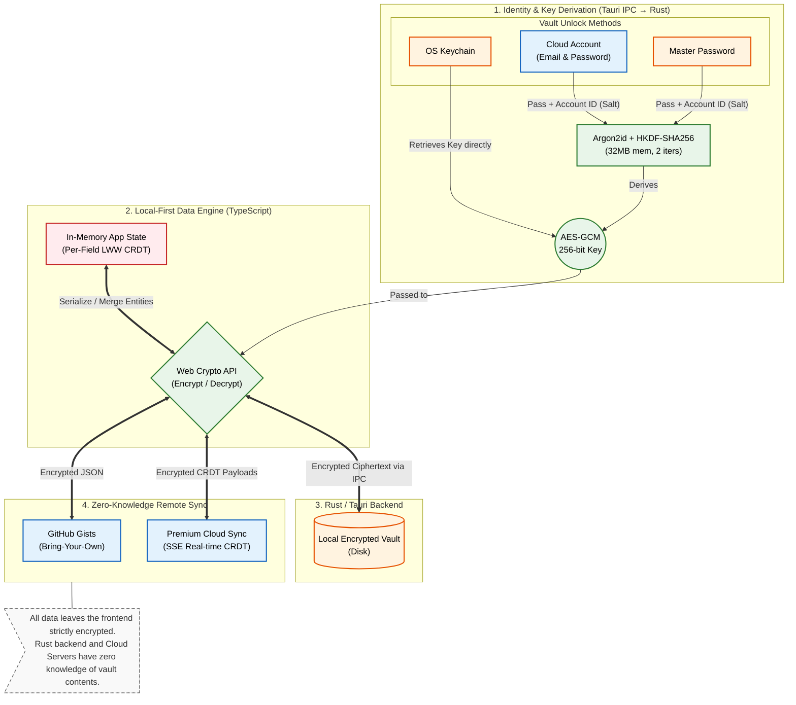

<div align="center">
  
  
  <br/>

  

  <h1>Voltius</h1>

  <p><strong>A modern SSH client built with Tauri, React, and Rust.</strong></p>

  <p>
    
    
    
    
  </p>
</div>

---

## ⚡ Why Voltius?

I built Voltius because I couldn't find an SSH client that checked every box. I wanted a tool that was blazingly fast and lightweight, featured a modern UI, and came complete with the features I actually use like Cloud E2EE Sync, SFTP host<->host w/ drag & drop...

Most existing tools are either stuck in the 90s, feel bloated, or lock essential features like device syncing behind expensive subscriptions. This project is my "no-compromise" solution: a native-speed, professional terminal that respects your data and your workflow.

## ✨ Features

### 🏠 Local-First Core (Free Forever)
No account required. Your data, your machine.
- **Plugin system:**
- **Gist Sync**: Decentralized state-based E2EE sync using private Gists. Each device maintains its own encrypted "blob" in your private Gist. Pulls are triggered via interval polling to keep your devices in sync without a central server.
- **SFTP:** Host/Local <-> Host/Local, supports drag & drop
- **Identity Management:** Manage your SSH keys and credentials and reuse them across connections.
- **Jump Hosts:** Define a chain of jump hosts to connect to hard-to-reach servers (SSH Tunneling).
- **SSH Config Import:** Import your existing `~/.ssh/config` and keep it in sync (read-only).
- **SSH Agent Forwarding:** Forward your SSH agent to use local keys on remote hosts.
- **Environment Variables:** Set environment variables for each connection.
- **Custom Commands:** Define pre-connection and post-connection commands.
- **Import/Export:** No vendor lock-in, Import/Export your vaults in a few clicks
- **Docker:** Manager Docker resources and open terminals directly in Voltius.
- **Serial Console:** Connect to serial devices directly from Voltius.
- **System Monitoring:** Live CPU, memory, and disk usage stats from connected hosts.
- **Local Terminal:** Start local terminals (Bash, Zsh, Fish, PowerShell, WSL, Git Bash, CMD, Cygwin, Cmder).
- **Port-Forwarding:** Automatic detection of open ports on connected hosts and one-click port forwarding.
- **Snippets**
- **Reachability checks:** Status badges and Latency indicators. Automatic ping checks with customizable intervals.
- **Encrypted Keychain:** Store encrypted keys/identities that you can reuse in hosts. Comes with useful features such as "Add to Host" to quickly add a public key to an host.
- **Command Palette (Cmd+K):** Search servers, switch teams, and trigger actions instantly.
- **Zero-Knowledge Sync:** Your data is encrypted locally before being synced. We can't read it, and neither can hackers.
- **Multi-Tab Support:** Native-speed tabs integrated into the window title bar.
- **Custom Themes:** Comes with built-in themes and you can make your own and share it !
- **Folders & Tags**
- **Cross-Platform:** Single-binary performance for macOS, Windows, and Linux.
- **Auto-Updates**
- **Status Badges:** Shows hosts status by using ping polling

### ⚡ Pro ($7/mo annual · $9/mo monthly — 14-day free trial, no card)
- **Real-Time Cloud Sync:** High-performance real-time engine using CRDTs for instant, conflict-free merging and SSE for sub-second updates across all devices.
- **Unlimited Private Vaults**
- **Terminal Sharing:** Share a terminal session ad-hoc with 1 guest — great for pair debugging or quick help.

### 👥 Teams ($15/user/mo annual · $18/user/mo monthly — 3-user minimum)
- **Team Vaults:** Shared vaults with easy member invites
- **Shared terminals (unlimited guests)**
- **Role-Based Access Control (RBAC):** Only default roles for teams plan, granular permissions and custom roles are reserved for Business plan to avoid complexity for small teams.
- **Audit Logging**

### 🏢 Business ($30/user/mo — contact us)
- **On-premise self-hosted backend**
- **Priority SLA support**
- **Granular permissions & Custom Roles**
- **Custom contracts**

## ⚖️ Comparison

| Feature                        | Voltius                                | Termius                          | [Reach](https://github.com/alexandrosnt/Reach) | [Termix](https://github.com/Termix-SSH/Termix) | Tabby               | PuTTY    |
|:-------------------------------|:-----------------------------------------|:---------------------------------|:-----------------------------------------------|:-----------------------------------------------|:--------------------|:---------|
| **Engine**                     | **Rust + Tauri** 🦀                      | Electron                | **Rust + Tauri** 🦀                            |                                                | Electron / Node.js           | C        |
| **RAM Usage**                  | ~300MB                                | ~500MB+                          | ~300MB                                      | NOT TESTED                                     | NOT TESTED             | **~5MB** |
| **Installed Size**             | ~60MB                                | ~1GB                           | ~60MB                                      | NOT TESTED                                     | NOT TESTED              | **~3MB** |
| **Cloud Sync**                 | Gist (Free) / Real-Time (Paid)           | Proprietary (Paid)               | ❌                                              | ❌                                              | Community Plugins   | ❌        |
| **Import/Export**              | ✅                                        |                                  |                                                |                                                |                     |          |
| **Port Forwarding**            | ✅                                        | ✅                                |                                                |                                                |                     |          |
| **Snippets**                   | ✅                                        | ✅                                |                                                |                                                |                     |          |
| **Multi-Exec snippets**        |                                          |                                  |                                                |                                                |                     |          |
| **Command Palette**            | ✅                                        | ✅                                |                                                |                                                |                     |          |
| **Multi-tab**                  | ✅                                        | ✅                                |                                                |                                                |                     |          |
| **Team vaults**                | ✅                                        | ✅                                |                                                |                                                |                     |          |
| **Custom Themes**              | ✅                                        |                                  |                                                |                                                |                     |          |
| **Folders &amp; Tags**         | ✅                                        | ✅                                | ✅                                              |                                                |                     |          |
| **Auto-Updates**               | ✅                                        | ✅                                | ✅                                              |                                                |                     |          |
| **Modern UI/UX**               | ✅                                        | ✅                                | 🟡                                             | ✅                                              | 🟡                  | ❌        |
| **AI assistant**               | ❌                                        | ✅                                | ✅                                              |                                                |                     |          |
| **Permissions**                | ✅ (Granular permissions w/ Custom Roles) | 🟡 (Basic)                       |                                                |                                                |                     |          |
| **Terminal sharing**           | ✅ Pro (1 guest) / Teams (unlimited)      | ✅                                |                                                |                                                |                     |          |
| **Security**                   | **End-to-End Encrypted**                 | Cloud Sync (Proprietary)         |                                                |                                                | Local Only / Manual |          |
| **SFTP host&lt;-&gt;host**     | ✅                                        | ✅                                | ❌                                              |                                                | ❌                   | ❌        |
| **Serial Console**             | ✅                                        | ✅                                |                                                |                                                |                     |          |
| **Local-first**                | ✅ 100% (No account needed)               | ❌ (Requires account)             | ✅                                              | ✅                                              | ✅                   | ✅        |
| **Plugins**                    | ✅                                        | ❌                                | ❌                                              | ❌                                              | ✅                   | ❌        |
| **Platoforms**                 |                                          |                                  |                                                |                                                |                     |          |
| **Pricing**                    | Free / Pro $7 / Teams $15 / Business $30 | Very limited free tier (no sync) | Free                                           | Free                                           | Free                | Free     |
| **License**                    | **AGPLv3 (Core)**                        | Commercial / Paid                |                                                |                                                |                     |          |


TODO add features I dont have (objective comparison) and make 🚧 if they are planned

## 🛡️ Architecture & Security
Voltius is built on a **Local-First, Zero-Knowledge** architecture. Your sensitive data (private keys, passwords, and server metadata) is encrypted on your machine before it ever touches a disk or a network.

### Account & Encryption Tiers
We offer three levels of security to fit your workflow:

- **OS Keychain (Local-Only)**: Uses your system's native secure storage (macOS Keychain, Windows Credential Manager, or Secret Service via keytar/libsecret). No master password required; maximum convenience for local-only use.

- **Master Password:** Encrypts your vault using a user-defined passphrase. Uses Argon2id for key derivation and AES-256-GCM for data encryption.

- **Cloud Account:** Enables seamless E2EE synchronization across devices via our high-speed relay service.

### Zero-Knowledge Synchronization
Whether you use our professional Cloud Sync or our built-in Gist Plugin, we follow a **Zero-Knowledge** protocol.



## Prerequisites

- [Node.js](https://nodejs.org/) 18+
- [pnpm](https://pnpm.io/) — `npm i -g pnpm`
- [Rust](https://rustup.rs/) (stable toolchain)
- Tauri prerequisites for your platform — see [tauri.app/start/prerequisites](https://tauri.app/start/prerequisites/)

## 🛠️ Development

### 🐧WSL2 dev note

```sh
sudo apt install -y build-essential libssl-dev pkg-config libgtk-3-dev libwebkit2gtk-4.1-dev
LIBGL_ALWAYS_SOFTWARE=1 && pnpm tauri dev
```

```bash
pnpm install
pnpm tauri dev
```

### Build

```bash
pnpm tauri build
```

Output installers are placed in `src-tauri/target/release/bundle/`.

## 🛠️ Tech Stack

| Layer    | Tech                               |
|----------|------------------------------------|
| Frontend | React 19, TypeScript, Tailwind CSS |
| Backend  | Rust, Tauri 2, PostgreSQL (Sync)   |
| Terminal | xterm.js (WebGL Accelerated)       |
| SSH/SFTP | russh (Custom Rust implementation) |
| Security | Argon2id, AES-256-GCM (E2EE)       |

## 🗺️ Roadmap
-  [ ] Import Cloud (AWS, Azure, DigitalOcean) (Only for Pro plan, need to make sure it can't be bypassed by forking Tauri Client)
-  [ ] Execute snippets on multiple hosts at once (add context menu option "Execute Snippet...")
- [ ] Native Mobile App (via Tauri Mobile)

## 📄 Licensing
Copyright © 2026 Killian Pavy. All rights reserved.

**Client Application:** Licensed under AGPLv3. We believe in the right to repair and sovereign data.
**Cloud Backend:** The real-time sync relay is Closed-Source to support the sustainability of the project.
**Self-Hosting:** The Enterprise tier allows for a self-hosted version of the full infrastructure.
